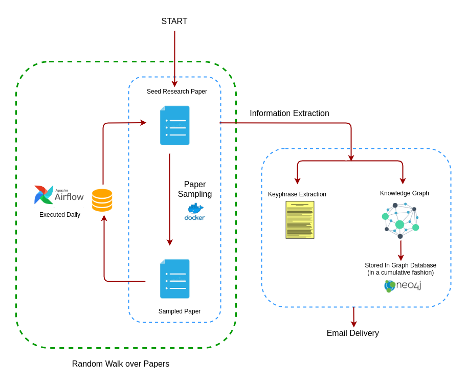
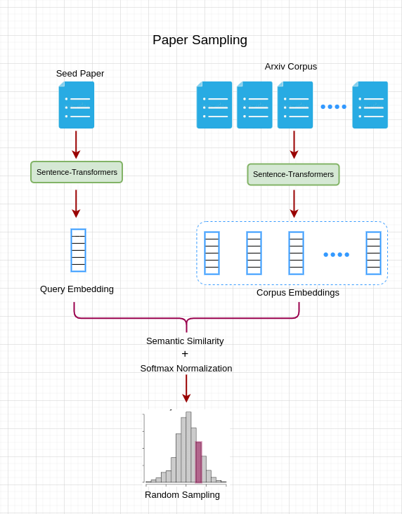

   
  
   

   
    
    
    
   

## What is Paper Dots ?
Paper Dots is an automatic insights extraction tool from research papers, which 
* Automatically annotates a research paper PDF with important keyphrases, ensuring faster skim-reading of papers
* Builds cumulative Knowledge Graph on top of papers read so far, helping in tracking important concepts
* Delivers relevant papers continuously through mail, promoting consistent and directed learning

The end-to-end pipeline is shown below:

  

## Approach
There are 3 main components to the project:
* **Keyphrase Extraction**
* **Knowledge Graph construction**
* **Paper sampling**

The papers are sampled from [Arxiv corpus](https://www.kaggle.com/Cornell-University/arxiv) (hosted on Kaggle). To enable semantic search over the papers, we had to first obtain the embeddings for each of the papers in the corpus, for which we used [Sentence-Transformers](https://github.com/UKPLab/sentence-transformers).  
The corpus embeddings are available and can be downloaded from [here](https://drive.google.com/file/d/1EDdcti5J0y4L1jvuiEdpKAHDkGfJf7LT/view?usp=sharing) for research purposes.  
Once the corpus embeddings are in place, a new paper can be sampled from the corpus using the seed paper as follows:

  

## Code Structure
> 

    Paper-Dots
    
    ├── docs
    ├── tests
    ├── output
    ├── LICENSE
    ├── README
    ├── src
    |   ├── config.py
    |   ├── information_extraction.py                     # Driver of Information Extraction pipeline
    |   ├── extractor.py
    |   ├── constituency_parser.py
    |   ├── mail_sender.py
    |   ├── model_loader.py
    |   ├── mongo_utils.py
    |   ├── paper_walk.py
    |   ├── task_keyphrase_extraction.py                  # Task 1
    |   ├── task_knowledge_graph.py                       # Task 2
    |   ├── utils.py
    │   ├── paper_sampler                                 
    |   |   ├── app.py                                    # Flask App
    |   |   ├── Dockerfile
    |   |   ├── paper_sampler.py
    |   |   ├── utils.py
    |   |   ├── requirements.txt
    |   |   ├── data
    |   |   |   ├── corpus_embeddings.hdf5                # Embeddings of Arxiv dataset (5.5 GB)
    |   |   |   ├── corpus_ids.pkl                        # Corresponding IDs of the paper
    
    
    

## How to use ?
Currently, the end-to-end pipeline is only configured for personal use, but we are working on it to make it available for public.
However, you can send a mail to **paperdotsai@gmail.com** with the link of your seed paper, and we will onboard you in the next iteration.

## How to contribute ?
Feel free to raise requests for new features :)

## Contact
**paperdotsai@gmail.com**

## References

## License